# Getting Started with SAS Intelligent Decisioning

* [Exercise Description](#exercise-description)
* [Log in to SAS Viya](#log-in-to-sas-viya)
* [Load CAS Data In-Memory](#load-cas-data-in-memory)
* [Create and Test an Assignment Rule Set](#create-and-test-an-assignment-rule-set)
* [Create and Test a DS2 Code File](#create-and-test-a-ds2-code-file)
* [Create and Test a Decision](#create-and-test-a-decision)
* [Exercise Completed](#exercise-completed)

## Exercise Description
In this hands-on exercise, you'll learn how to create a simple decision step-by-step. You will use the SAS Intelligent Decisioning interface to create rule sets and other decision elements, arrange decision objects in a workflow, and test the completed decisions for accuracy.

<br>

## Log in to SAS Viya
Open a new window in the *Google Chrome* browser and select the **SASLanding** bookmark.

* ID: **student**
* Password: **Metadata0**

Select **No** when prompted about accepting *Admin* privileges.

<br>

## Load CAS Data In-Memory
1. Select  **&#10132; Manage Data** to open *SAS Data Explorer*.
1. Select the **Import** tab.
1. Select **Local Files** to import a file.

   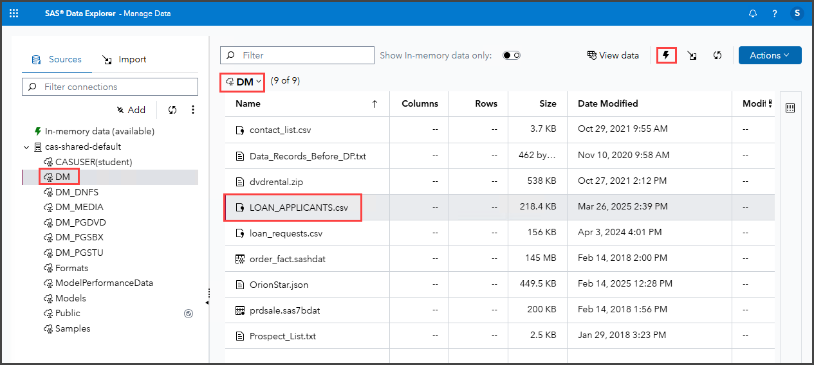

1. Navigate to **workshop (\\server.demo.sas.com) (W:) &#10132; SID**
1. Select the **LOAN_APPLICANTS.csv** file and click **Open**.

   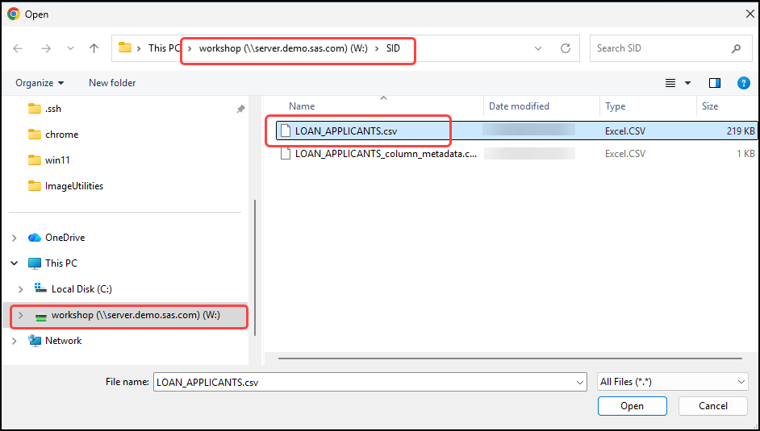

1. The default options are fine, so click **Import Item** to import the data from the file to a table in the *Public* CAS library.

   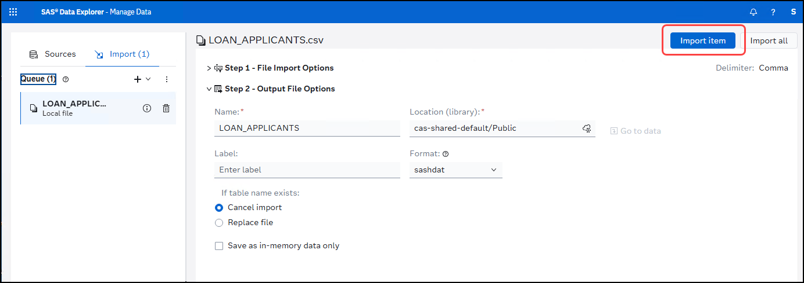

1. Select the **Sources** tab.
1. Select the **In-memory data (available)** source to confirm the **LOAN_APPLICANTS** table is now listed there.

   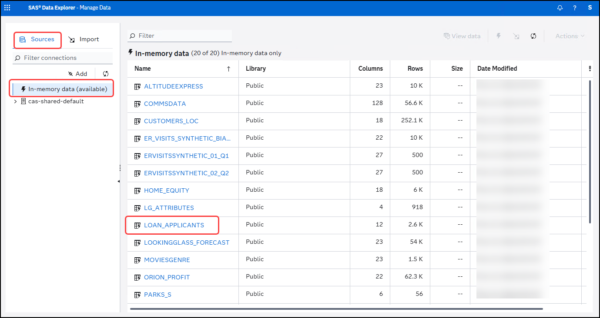

1. Select the **LOAN_APPLICANTS** table hyperlink to view its *Details*.
1. Select the **Sample data** tab to view a sample of the data set.
1. Click the **x** in the right-corner of the window to close the table.

   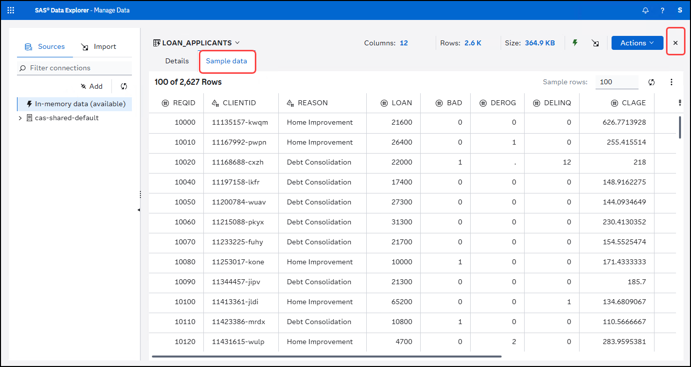

<br>

## Create and Test an Assignment Rule Set

1. Select  **&#10132; Build Decisions** to open *SAS Intelligent Decisioning*.
1. Select  to open the **Rule sets** page.
1. Click **New rule set** to create a new rule set.

     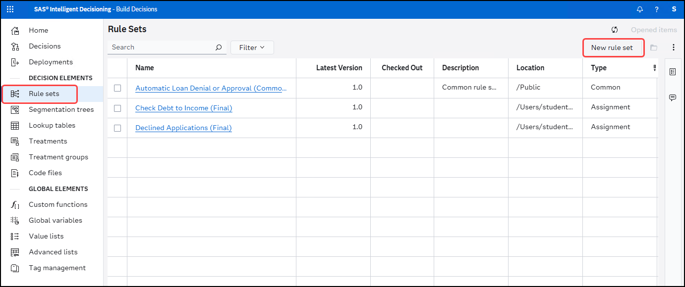

1. Enter the following information for the new rule set:
    * Name: **Initial_Loan_Review**
    * Type: **Assignment**
    * Description: **Initial Loan Review Assignment Rule**
    * Location: **/Public/SID Workshop**

        > &#9755; Select  to navigate to *SAS Content/Public*, then select  **&#10132; Folder** to create a new folder named *SID Workshop* if the workshop folder does not already exist.

        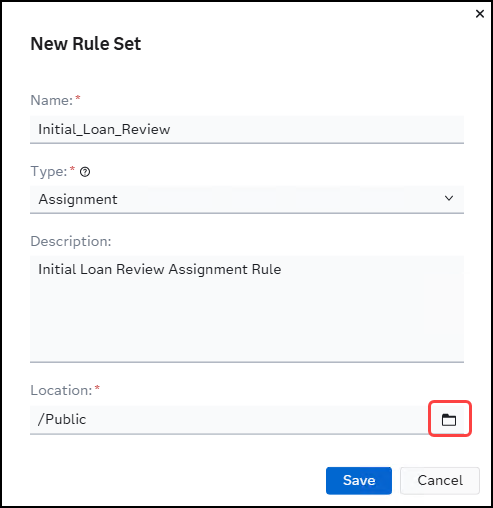

1. Click **Save** to create the rule set.
1. On the **Variables** tab, ensure that the **Rule Set Variables** sub-tab is selected.
1. Select **Add variable &#10132; Data table** to add variables from an *in-memory* table.

   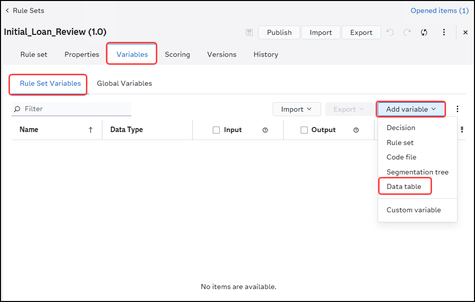

1. Select  in the **Data table** selection.
1. In the *Choose Data* dialog, select *Recent* from the drop-down menu next to *Show*, then select **LOAN_APPLICANTS** from the available data list and click **OK**.

   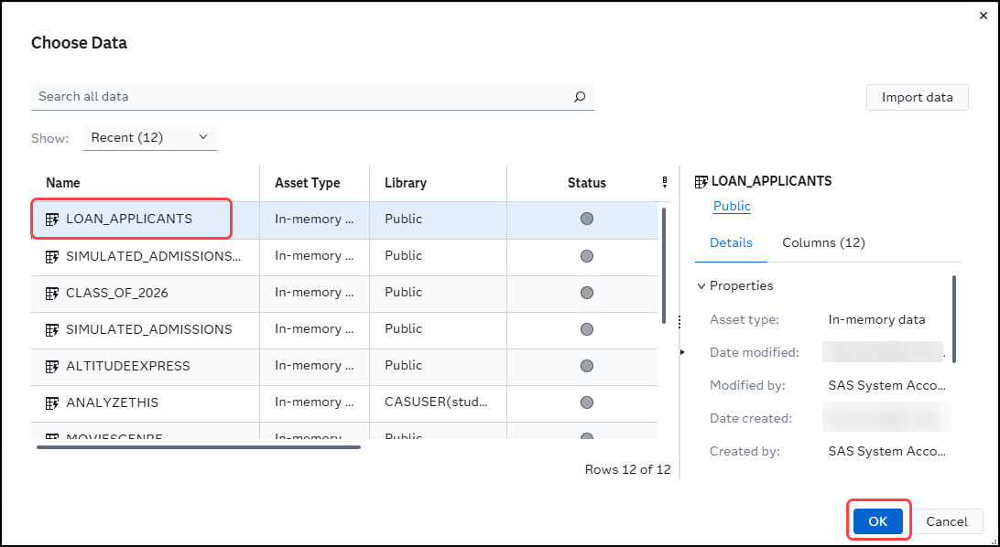

1. Click  to select all the columns from the table and add them to the selected items side.

   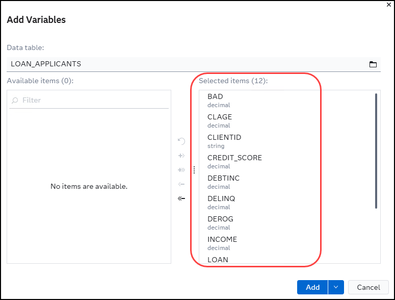

1. Click **Add** to add the selected items as variables for the rule set.

   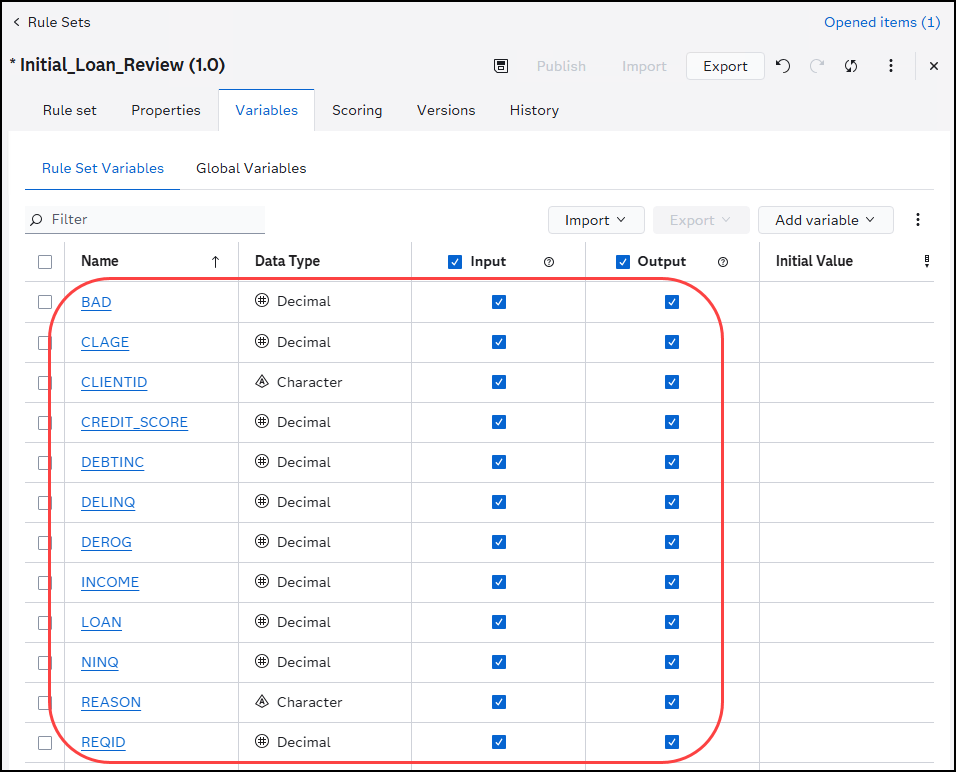

    > &#9998; The variables are automatically added as both *Input* and *Output* variables. You can uncheck those selections as appropriate for your rule set.

1. To add some output custom variables, select **Add variable &#10132; Custom variable**.
1. Expand the **Optional** section.
1. Enter the following:
   * Name: **STATUS**
   * Data type: **Character**
   * Description: **Loan Status**
   * Length: **8**

   

1. Click **Add**.
1. Uncheck **Input**.

     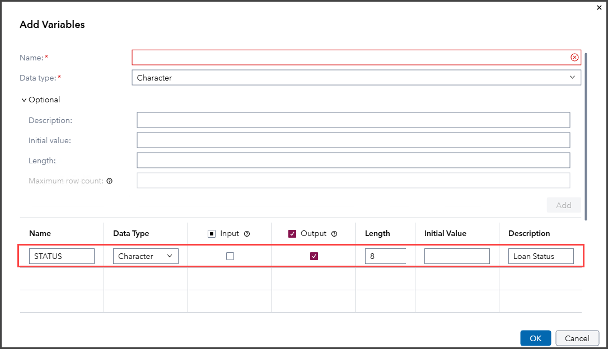

1. Repeat steps 13-15 to add the following additional output custom variables:

| Name | Data type | Input | Output | Length | Initial Value | Description |
|  :---:  |  :---:  |  :---:  |  :---:  |  :---:  |  :---:  |  :---:  |
| JUSTIFICATION  | Character |       | checked | 50 | UNDER REVIEW | Justification for Loan Approval Status |
| OFFER_RATE | Decimal |       | checked |       |       | Interest Rate to Offer with Loan Approval |

   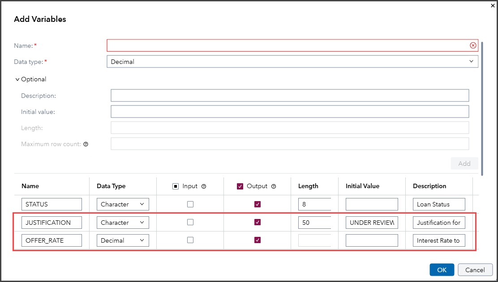

1. Click **OK** to add the custom variables to the rule set.
1. Click  to save the rule set.

    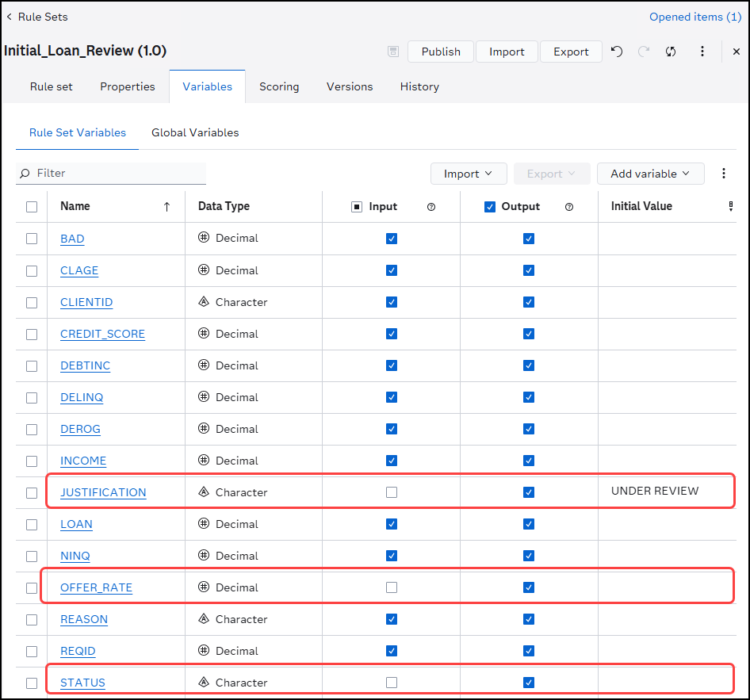

1. Select the **Rule set** tab.
1. Click **Add other**.
1. Select **Assignment** for the *rule type* and click **OK**.

   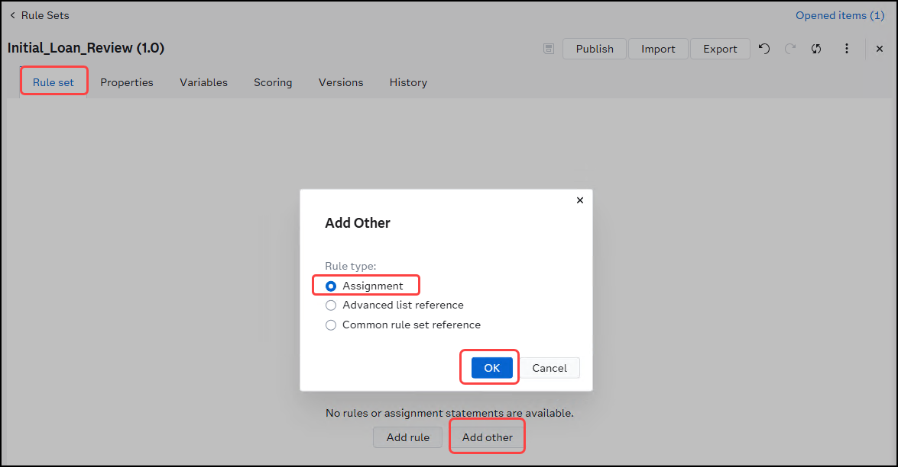

1. For the action assignment, select **ASSIGN STATUS 'REVIEW'**.
1. Click **+ Add Rule** to add a rule block.

   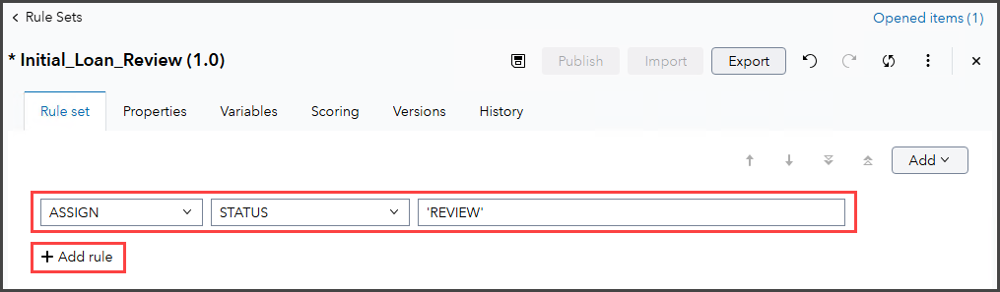

1. Name the rule **Automatic Loan Denial or Approval**.

   > &#9755; Select  **&#10132; Edit rule information**.

1. Select the following for the rule:<br>
   **IF BAD = 1**<br>
   **THEN ASSIGN STATUS 'DENIED'** <br>
    **&nbsp; &nbsp; &nbsp; &nbsp; &nbsp; &nbsp;ASSIGN JUSTIFICATION 'AUTOMATIC DENIAL CRITERIA MET'**

    > &#9755; Hover over the first *ASSIGN* statement to surface statement options, then click  to add the second *ASSIGN* statement.

     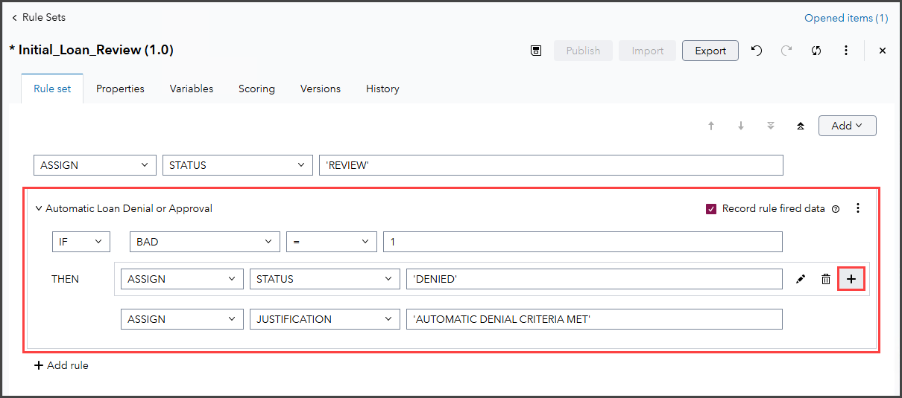

1. Click  to save the rule set.
1. Click **+ Add Rule** to add a new rule block.
1. Use the drop-down menu to change the **IF** to an **OR** to add an *OR* condition to the existing rule block.
1. Select the following for the *OR* condition:<br>
   **OR DEBTINC > 50.0** <br>
   **AND DEROG >= 2**

     > &#9755; Hover over the *OR* statement to surface statement options, then click  to add the *AND* statement.

   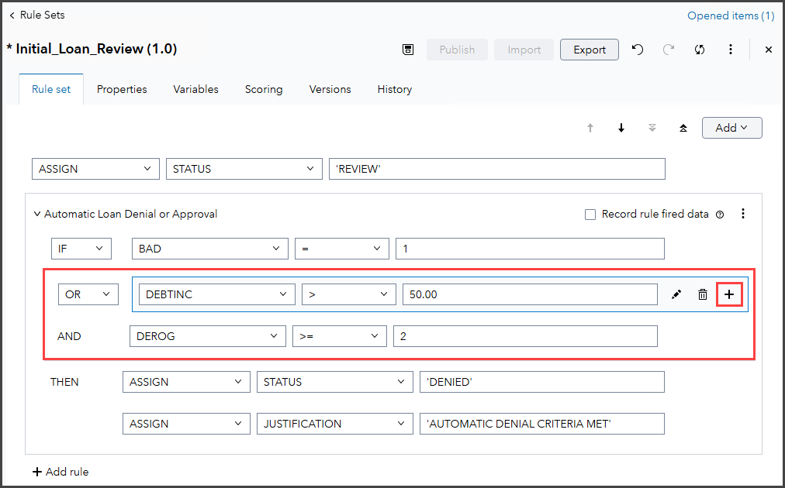

1. Click **+ Add Rule** to add a new rule block.
1. Change the **IF** to an **ELSE** to add an *ELSE IF* condition to the existing rule block.
1. Select the following for the *ELSE* condition: <br>
   **ELSE BAD = 0** <br>
   **AND LOAN <= 15000** <br>
   **AND DEBTINC < 10.0** <br>
   **THEN ASSIGN STATUS 'APPROVED'** <br>
   **&nbsp; &nbsp; &nbsp; &nbsp; &nbsp; &nbsp;ASSIGN JUSTIFICATION 'AUTOMATIC APPROVAL CRITERIA MET'** <br>
   **&nbsp; &nbsp; &nbsp; &nbsp; &nbsp; &nbsp;ASSIGN OFFER_RATE 2.75**

   > &#9755; Click  to add the *AND* statements and additional *ASSIGN* statements.

   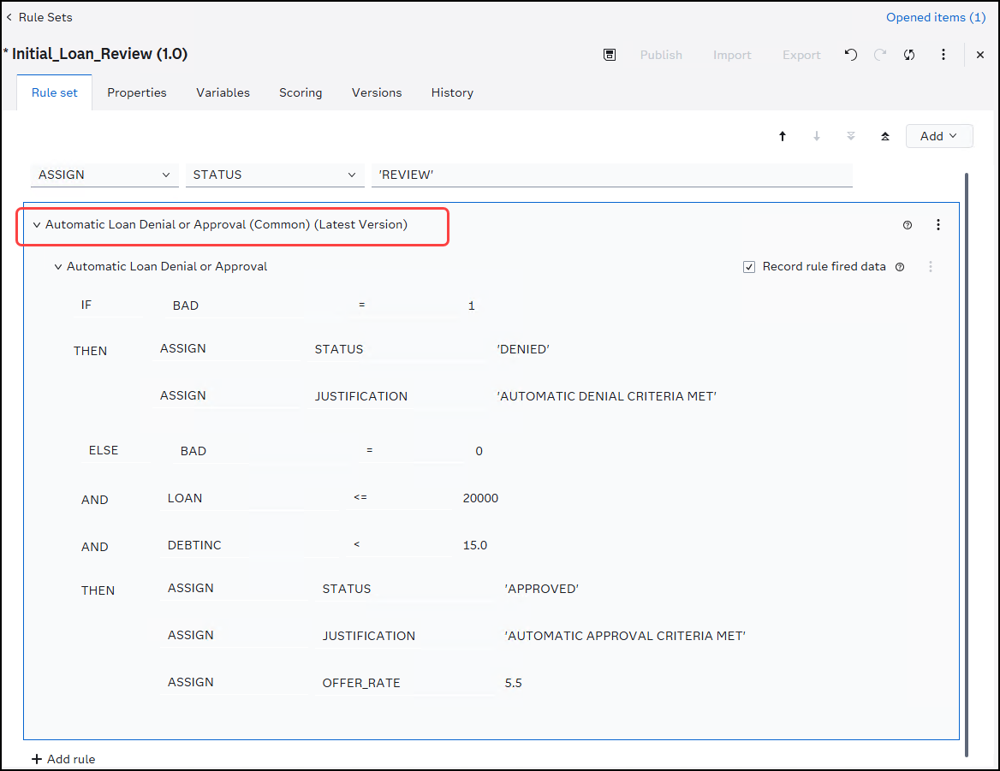

1. Click  to save the rule set.
1. To test the rule set, select the **Scoring** tab.
1. On the **Tests** sub-tab, click **New Test**.
1. Enter the following information:
   * Name: **Initial_Loan_Review_Test**
   * Description: **Test 1**
   * Location: **/Public/SID Workshop/Tests**
      > &#9755; Select  to navigate to *SAS Content/SID Workshop*, then select  **&#10132; Folder** to create a new folder named *Tests* if the test folder does not exist already.
   * Input table: **LOAN_APPLICANTS**.

   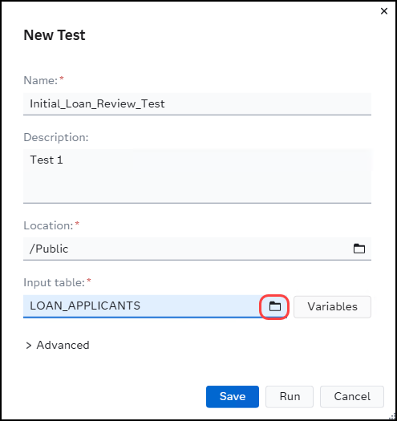

1. Click **Variables** to view the variables mapping between the input table and the rule set variables.

     > &#9998; All the variables are automatically mapped since the variable names on the rule set match the names on the input table.

1. Click **OK** to close the *Variable Mappings* dialog.
1. Click **Save** to save this test to the rule set.

     > &#9998; If you do not select **Save** and simply select **Run**, then the test is run; however, the test is not saved to the rule set and if your session is closed, you will need to set up the test again to run it in the future.

1. Check the newly created test and click **Run** to run the specified test.

     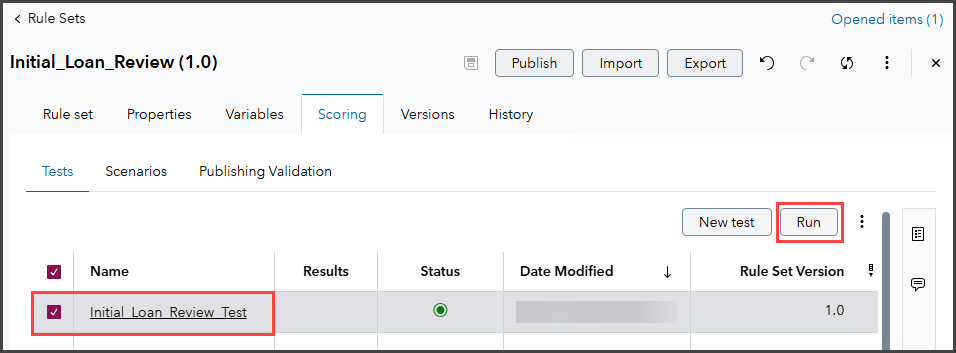

     > &#9998; It may take a few seconds for the test to complete.  You can select 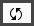 to refresh the test status.

1. Once the test run is complete, select  to view the test results.
1. Click **Rule-Fired Analysis** and **Run Rule-Fired Analysis** to view which records triggered a rule.

   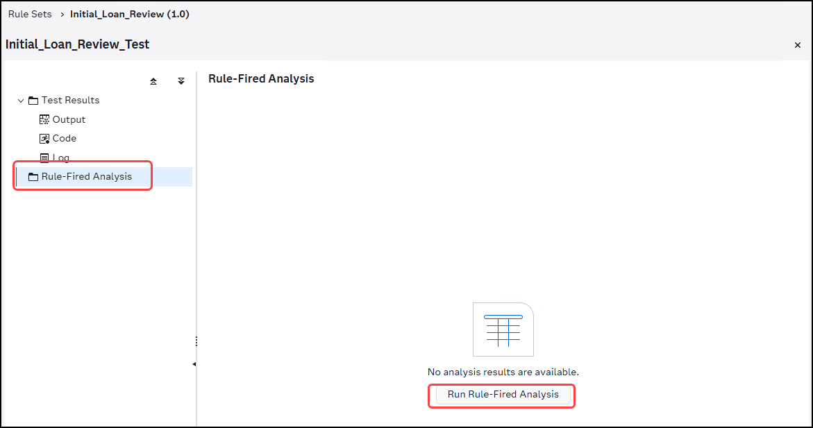

1. Once the rule-fired analysis has run, review the results on the *Analysis* tab.

   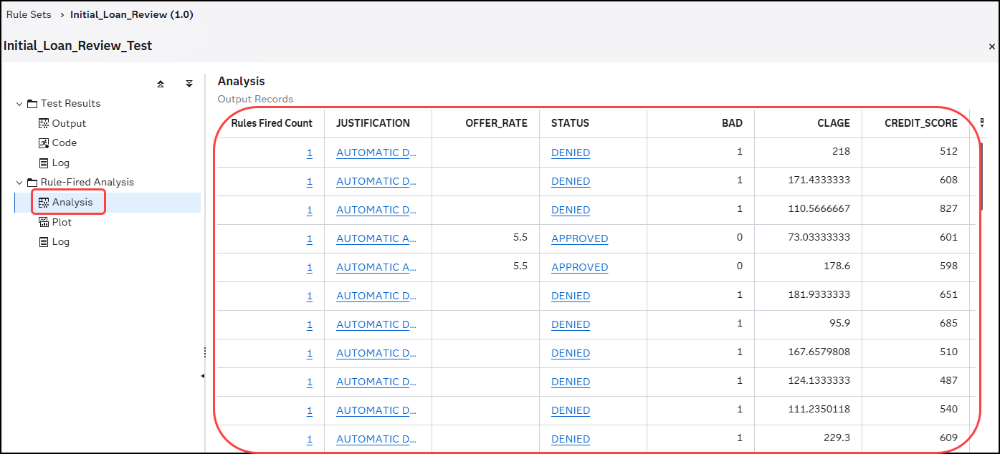

1. Click **x** to close the test results and the rule set.

<br>

## Create and Test a DS2 Code File
1. Select  to open the **Code files** page.
1. Click **New code file** to create a new code file.
1. Enter the following information:
    * Name: **Additional_Review**
    * Type: **DS2 Code File** (default selection)
    * Description: **Additional review for requests that have not been approved or denied**
    * Location: **/Public/SID Workshop**

     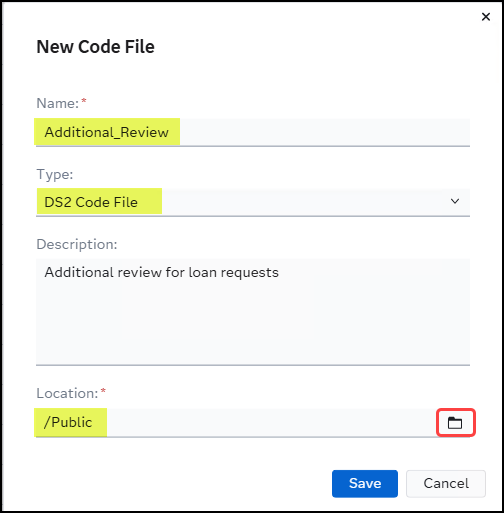

1. Click **Save** to create the DS2 Code file.
1. Replace the default code with the code block below:

    ```sas
    package "${PACKAGE_NAME}" /inline;
       method execute(in_out double CREDIT_SCORE,
                      in_out double INCOME,
                      in_out double LOAN,
                      in_out double OFFER_RATE,
                      in_out varchar JUSTIFICATION,
                      in_out varchar STATUS);

            if CREDIT_SCORE > 650 AND LOAN < INCOME then
                do;
                   STATUS = 'APPROVED';
                   JUSTIFICATION = 'APPROVED BASED ON CREDIT SCORE';
                   OFFER_RATE = 5.5;
                end;
            else if (CREDIT_SCORE >= 525 AND CREDIT_SCORE <= 650) AND LOAN  < 0.7 * INCOME then
                do;
                   STATUS = 'APPROVED';
                   JUSTIFICATION = 'APPROVED BASED ON CREDIT SCORE';
                   OFFER_RATE = 10.75;
               end;
            else
               do;
                   STATUS = 'DENIED';
                   JUSTIFICATION = 'DENIED BASED ON CREDIT SCORE AND/OR LOAN AMOUNT';
               end;
       end;
    endpackage;
    ```

     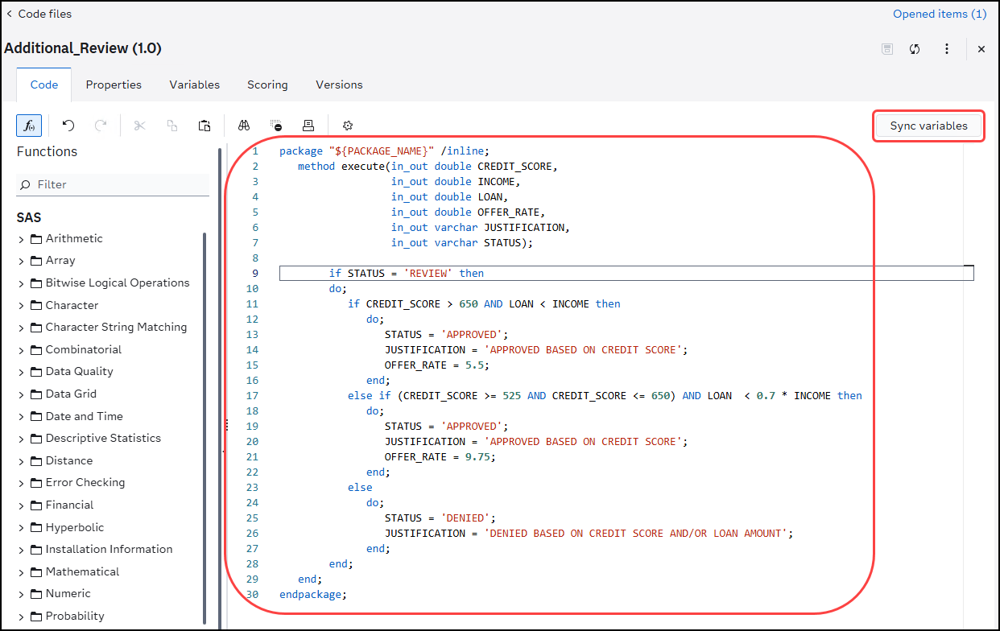

1. Click  to save the code file.
1. Click **Sync variables** to add the variables declared in the DS2 code to the *Variables* tab for for the code file.
1. Select the **Variables** tab to confirm the variables were added.

     

1. To test the code file, select the **Scoring** tab.
1. On the **Tests** sub-tab, click **New Test**.
1. Enter the following information:
   * Name: **Additional_Review_Test**
   * Description: **Test 1**
   * Location: **/Public/SID Workshop/Tests**
      > &#9755; Select  to navigate to *SAS Content/SID Workshop/Tests*.
   * Input table: **LOAN_APPLICANTS**.

   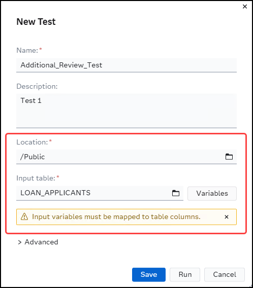

1. Click **Variables** to resolve the input variable mapping.
1. Enter the following information for unmapped variables:

   | Variable | Type | Table Column | Value |
   |  :---:  |  :---:  |  :---:  |  :---:  |
   | OFFER_RATE | Decimal | **Use value** | **0** |
   | JUSTIFICATION  | Character | **Use value** | **UNDER REVIEW** |
   | STATUS | Character | **Use value** | **REVIEW** |

   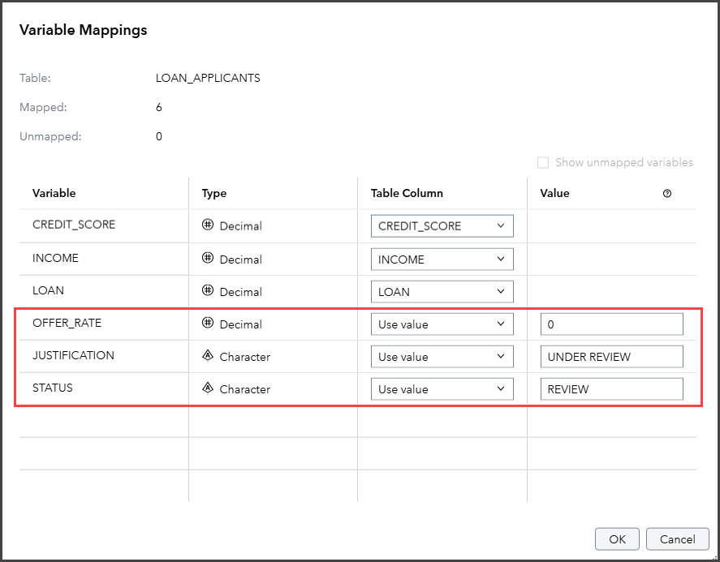

1. Click **OK** to close the *Variable Mappings* dialog.
1. Click **Save** to save this test to the code file.
1. Check the newly created test and click **Run** to run the specified test.

     

     > &#9998; It may take a few seconds for the test to complete.  You can select  to refresh the test status.

1. Once the test run is complete, select  to view the test results.
1. Review the results on the *Output* tab.

   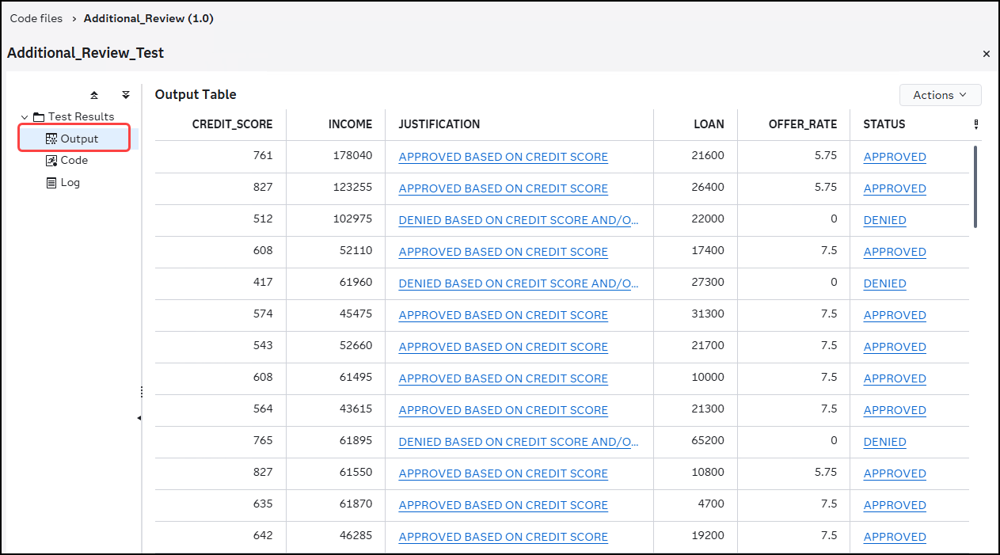

1. Click **x** to close the test results and the code file.

<br>

## Create and Test a Decision
1. Select  to open the **Decisions** page.
1. Click **New decision** to create a new decision.
1. Enter the following information for the new decision:
   * Name: **Loan_Request_Review**
   * Description: **Loan request review process for ABC Bank.**
   * Location: **/Public/SID Workshop**

     > &#9755; Select  to navigate to this folder in *SAS Content*.

      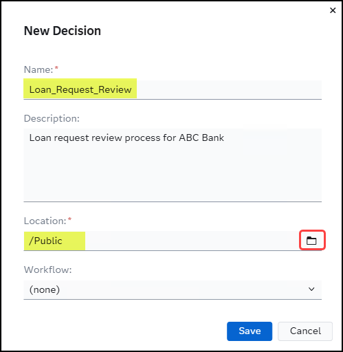

1. Click **Save** to create the decision.
1. On the *Start* node, select  **&#10132; Add below &#10132; Rule set**.

     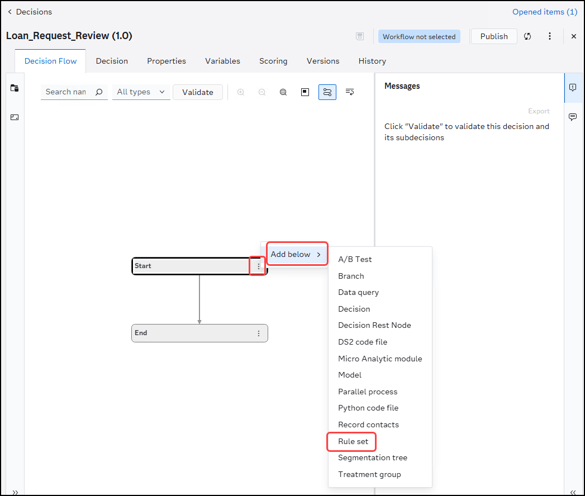

1. Navigate to the **SAS Content &#10132; Public &#10132; SID Workshop** folder.
1. Select the **Initial_Loan_Review** rule set.

     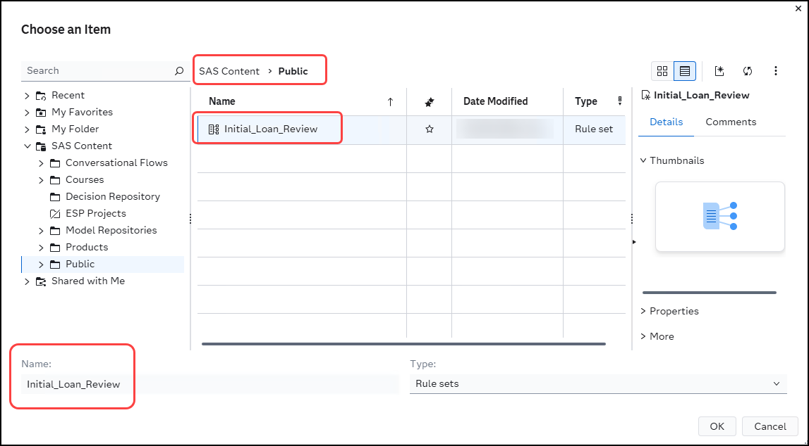

1. Click **OK** to add the selected rule set to the decision.

     > &#9998; There is an error since the variables from the rule set are not part of the decision.

1. Select  **&#10132; Add missing variables**.

     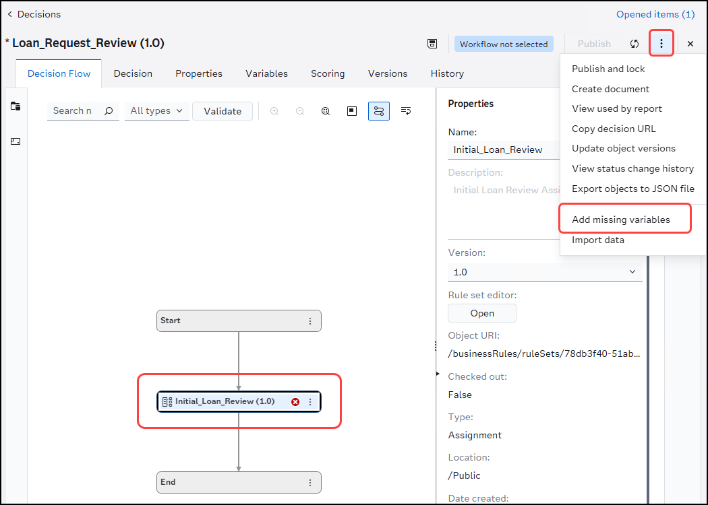

1. Click **Add** to add all the missing variables to the decision.
1. Click  to save the decision.
1. Select the **Variables** tab to review the added variables.

     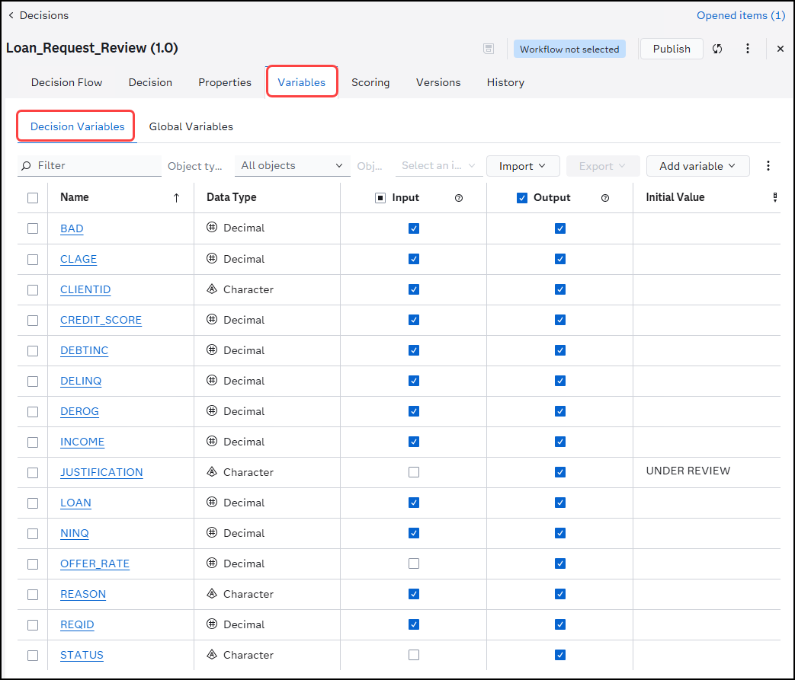

1. Select the **Decision Flow** tab.
1. On the *Initial_Loan_Review* node, select  **&#10132; Add &#10132; Branch**.

     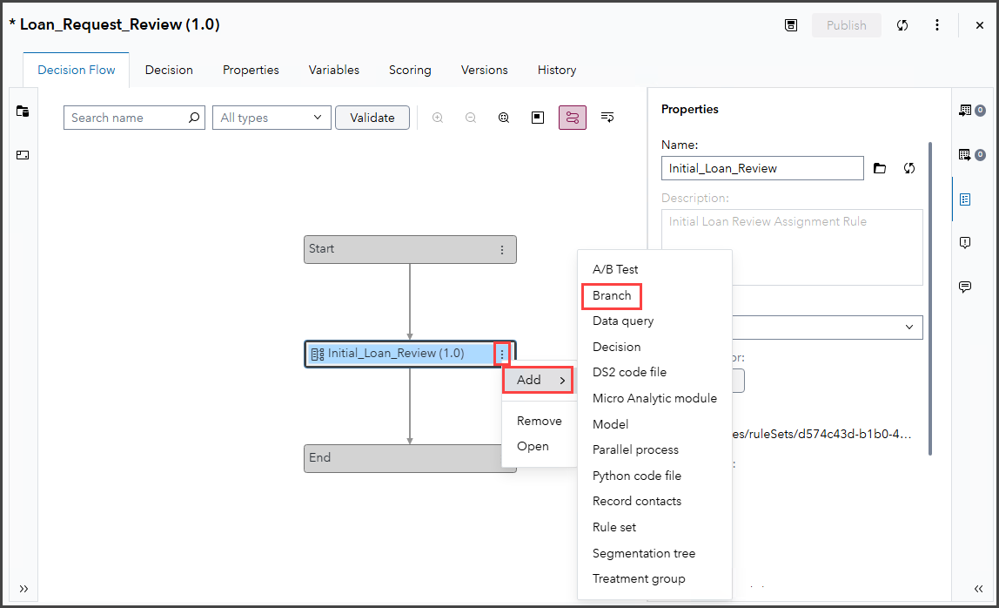

1. Enter the name **Loan Status** and select **Equals** for the branch type.

     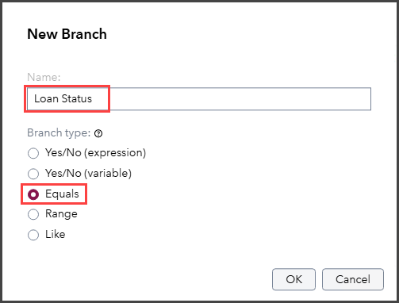

1. Click **OK** to create the branch.
1. In the *Properties* section, select the **STATUS** variable for the *Branch expression*.

     > &#9755; Select the drop-down menu under *Branch expression* to view the full list of variables.

1. Click  to add the following *paths*:
   * **"REVIEW"**
   * **"APPROVED"**
   * **"DENIED"**.

    > &#9998; The *Other* path is automatically added for this branch type.

1. Click  to save the decision.

     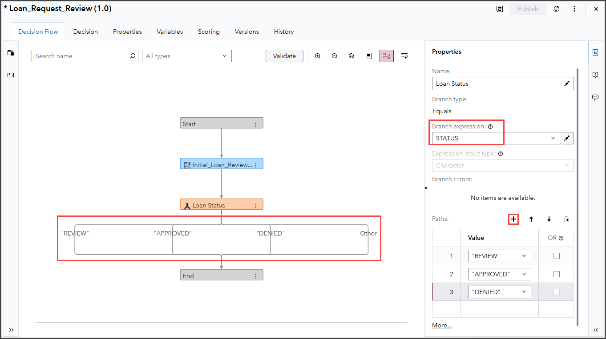

1. Right-click the path with the *"REVIEW"* branch and select **&#10132; Add &#10132; DS2 code file**.

   

1. Navigate to the **SAS Content &#10132; Public &#10132; SID Workshop** folder.
1. Select the **Additional_Review** DS2 code file and click **OK** to add the selected file to the decision.

     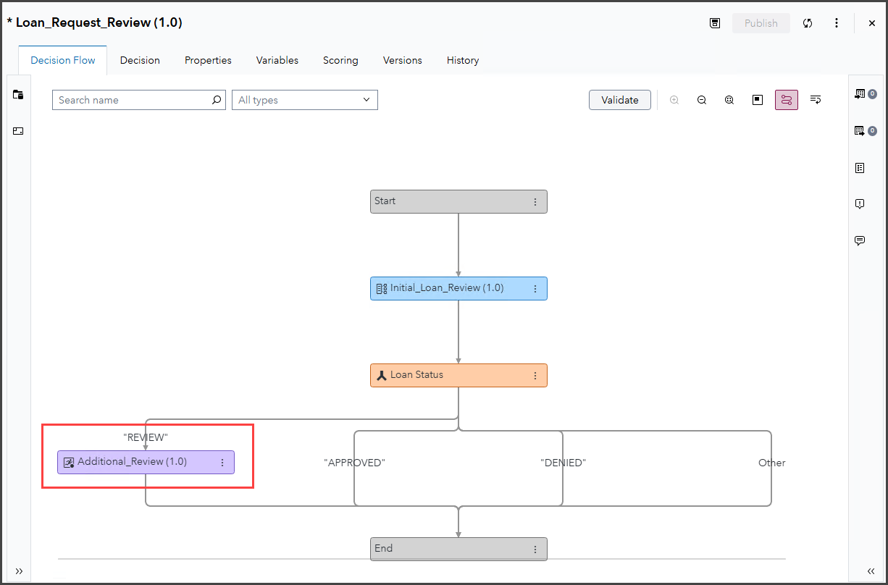

1. Click **Save** to save the decision.
1. Click **Validate** to validate the decision.

   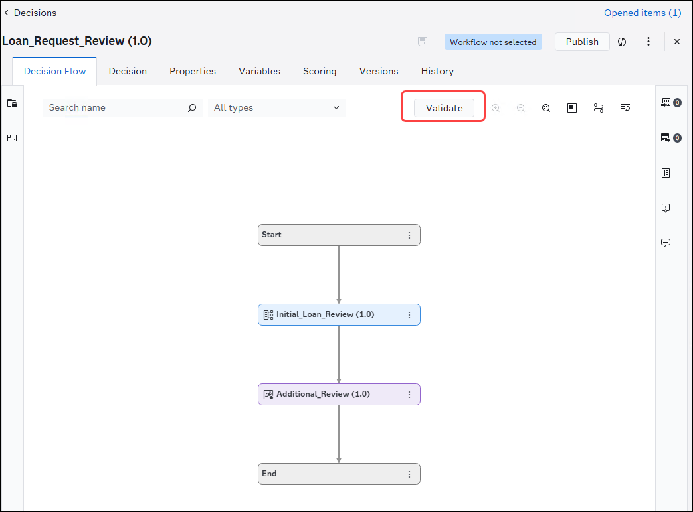

1. Select  on the right pane to confirm if the decision was validated successfully.

   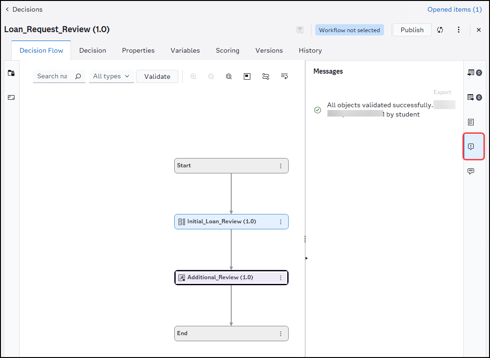

1. To test the decision, select the **Scoring** tab.
1. On the **Tests** sub-tab, click **New Test**.
1. Enter the following information:
   * Name: **Loan_Request_Review_Test**
   * Description: **Test 1**
   * Location: **/Public/SID Workshop/Tests**
      > &#9755; Select  to navigate to *SAS Content/SID Workshop/Tests*.
   * Input table: **LOAN_APPLICANTS**.

   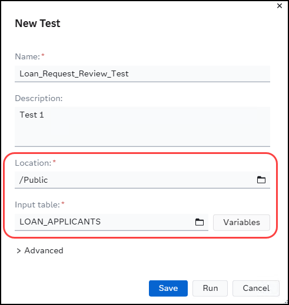

1. Click **Save** to save this test to the rule set.
1. Check the newly created test and click **Run** to run the specified test.
1. Once the test run is complete, select  to view the test results.
1. Review the results on the *Output* tab.

   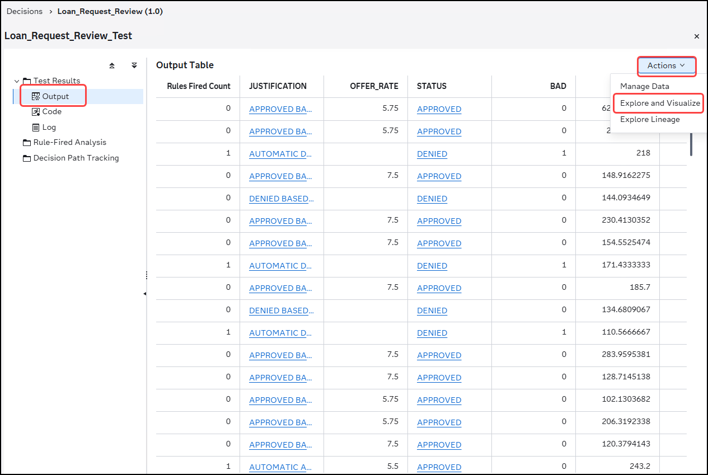

1. ***View results in VA***
1.
1. Click **x** to close the test results and the rule set.

<br>

## Exercise Completed

You have completed the exercise for **Getting Started with SAS Intelligent Decisioning**.

**THANK YOU FOR ATTENDING THIS SESSION!** <br>
**PLEASE COMPLETE THE EVALUATION!**
